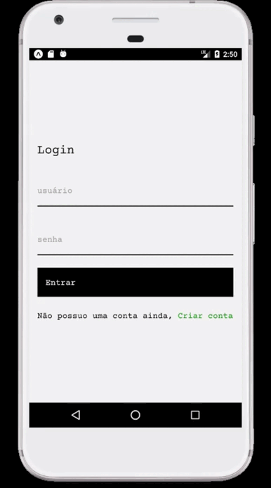

# ⚛️ Todo APP

<div align="center">
  Um aplicativo de todo (a fazeres)

  <br>

</div>


<br>



## Tecnologias

- Docker
- Typescript
- Expo
- Axios
- React/React-native

## Instalacao

```
$ npm install
```

## Iniciando APP

- Para iniciar com o expo, instale o [expo-cli](https://docs.expo.dev/)

- Logo em seguida, execute:

```
$ expo start
```

## Iniciando com Docker

- Instale o [Docker](https://www.docker.com/products/docker-desktop/)

- Inicie um container com

```
$ docker compose build
```

- Suba o container com 

```
$ docker compose up -d
```

## Para onde prosseguir

- Implementar datepickers para enviar ao backend e um observer pattern na lista de todos para verificar atrasos

- Observer para ver se a role do usuario é de administrador e assim acessar o endpoint de administrador
